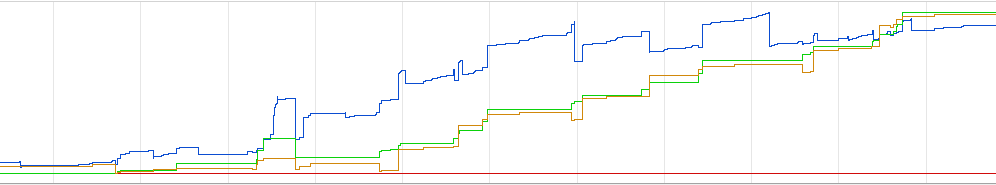
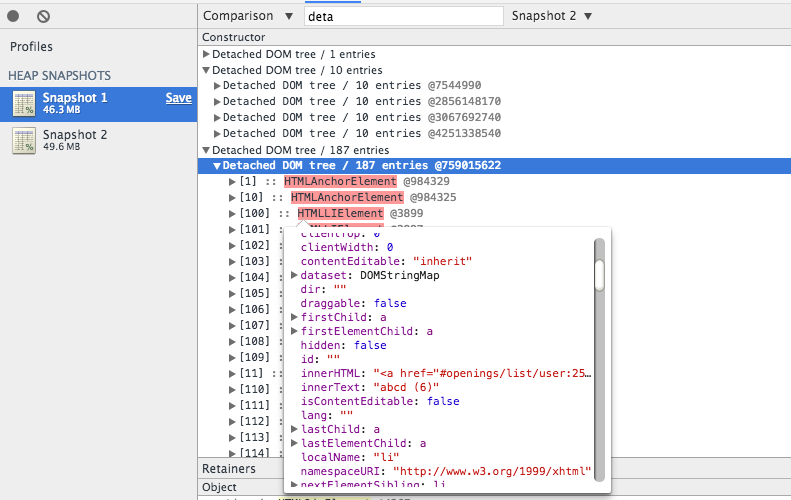
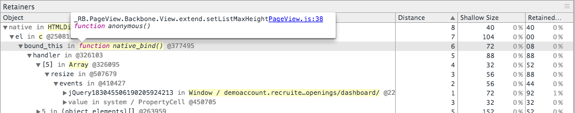
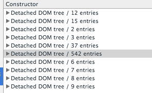
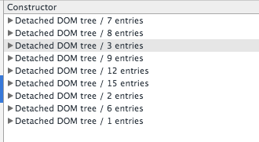

Building web apps is fun, it’s like building a small castle with lots of different parts and it raises to be the shiny new castle, that’s the fun part now come the sad part, after the castle is build there might be new modification to be done and some parts of the castle will be totally useless. It’s the case with web apps when we add new feature we forget about the some parts which may cause performance issue.

### Javascript Performance
Did your clients/customers complained about the performance of your web app? How will you get started?

There are different type of performance issue

- Scripting issue (script executions take a ton of time)
- Rendering issue (DOM manipulation this can be solved by React.js)
- DOM Leaks

### Lets look at DOM Leaks
1. ####Profile
	Create a new profile on chrome/canary without any extension this will help you to focus on your app.

2. ####Validate
	Use the dev tools timeline view to validate the performance issue is caused by DOM Leaks.
  Timeline gives you a brief idea of what is happening on your app.
  1. Go to the view/page where you think the cause of the issue
  2. Click on force GC(trash icon)
  3. Record
  4. Do some actions
  5. Stop recording

    Here is an example of memory usage on an app.
    
    Check out the DOM nodes, it's increasing, this will slow the app.
    So now we know there is some problem with DOM allocation.

3. ####Heap Snapshot
  Heap snapshot gives an in-depth knowledge of what has happened on the browser.
  1. Start from a clean slate, force the GC and take a snapshot
  2. Do some actions
  3. Take a new snapshot
  4. There is a different view for the snapshot, the most useful to identify DOM leaks is the comparison view. Use the comparison view to compare the snapshots recorded.
  5. Search for `detached`, which will show all the detached DOM in the browser memory.

    Here is an example
    
    Sometimes it's difficult to make sense what the DOM tree is and where is it coming from but that's okay this is a time-consuming work, skim through the list of DOM tree try to make sense on your app.

  6. Once you understand the DOM tree, Look at the Retainer view on the bottom. Retainers give you a detailed information about the selected DOM node. The Distance displays the distance to the root using the shortest simple path of nodes.

    Here is an example
    
		Over here the dom is bound to a function and that function is the culprit. Over here is it's an event listener. Fixing the issue will reduce the DOM leaks.

    Here is an example for before and after the fix
	  

		  

		  

	  

####Helpful links
 - [Writing Fast Memory Efficient](http://www.smashingmagazine.com/2012/11/05/writing-fast-memory-efficient-javascript/)
 - [Memory Profiling](https://developer.chrome.com/devtools/docs/javascript-memory-profiling)
